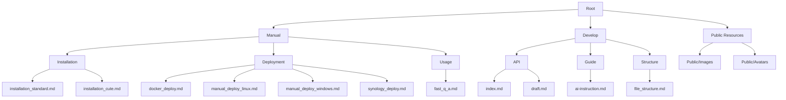

# VitePress Documentation Project (AI Reference)

## Project Architecture Overview


## File Organization
| Section | Path | Purpose |
|---------|------|---------|
| Root | /index.md | Main landing page with navigation and feature overview |
| Manual | /manual/ | User-facing documentation for installation and usage |
| Develop | /develop/ | Developer-facing documentation for API and structure |
| Installation | /manual/installation/ | Guides for installing and configuring MaiMBot |
| Deployment | /manual/deployment/ | Various deployment methods (Docker, Linux, Windows, NAS) |
| Usage | /manual/usage/ | Guides for using and troubleshooting MaiMBot |
| API | /develop/api/ | API documentation and references |
| Guide | /develop/guide/ | Development guidelines and workflows |
| Structure | /develop/structure/ | Project structure explanations |

## Key Files and Their Purposes
| File | Purpose |
|------|---------|
| /index.md | Main landing page with hero section and navigation |
| /manual/index.md | User manual landing page |
| /develop/index.md | Developer documentation landing page |
| /manual/installation/installation_standard.md | Standard installation guide |
| /manual/installation/installation_cute.md | Beginner-friendly installation guide |
| /manual/deployment/docker_deploy.md | Docker deployment instructions |
| /manual/deployment/manual_deploy_linux.md | Linux manual deployment guide |
| /manual/deployment/manual_deploy_windows.md | Windows manual deployment guide |
| /manual/deployment/synology_deploy.md | Synology NAS deployment guide |
| /manual/usage/fast_q_a.md | FAQ and troubleshooting guide |
| /develop/api/index.md | API overview and documentation |
| /develop/structure/file_structure.md | Detailed project structure explanation |
| /develop/guide/ai-instruction.md | AI-assisted development guide |

## Navigation Structure
- Home (/)
  - Manual (/manual/)
    - Installation (/manual/installation/)
    - Deployment (/manual/deployment/)
    - Usage (/manual/usage/)
  - Develop (/develop/)
    - API (/develop/api/)
    - Structure (/develop/structure/)
    - Guide (/develop/guide/)

## Static Assets
- /public/avatars/ - Avatar images including MaiM.png (favicon)
- /public/images/ - Documentation images and screenshots

## Build Commands
```
pnpm docs:dev    # Start development server
pnpm docs:build  # Build production site
pnpm docs:preview # Preview production build
```

## Content Types
1. **User Documentation**: Installation guides, deployment instructions, usage examples
2. **Developer Documentation**: API references, project structure, development workflows
3. **Interactive Elements**: Hero sections with CSS styling, feature grids
4. **Visual Assets**: Screenshots, diagrams, logos

## Project Context
This is a VitePress documentation site for a project called "MaiMBot", which is an intelligent chatbot for QQ groups. The documentation is organized into two main sections:

1. Manual (user-facing) - Contains installation guides, deployment methods, and usage instructions
2. Develop (developer-facing) - Contains API documentation, project structure explanations, and development guides

The site aims to provide comprehensive documentation for both regular users and developers who want to extend or modify MaiMBot.