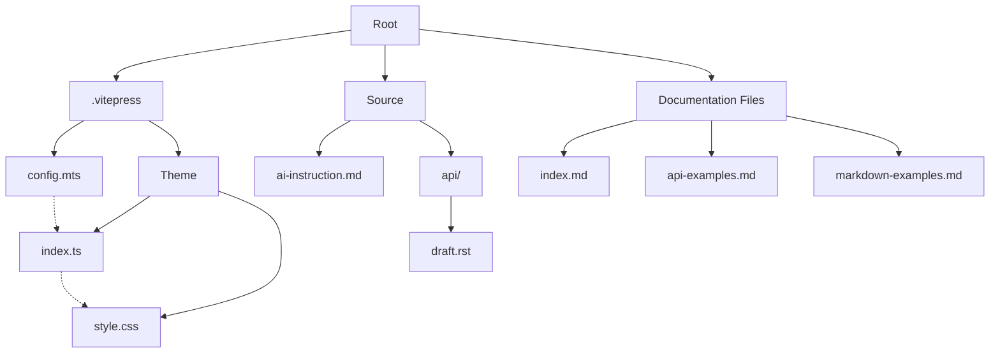
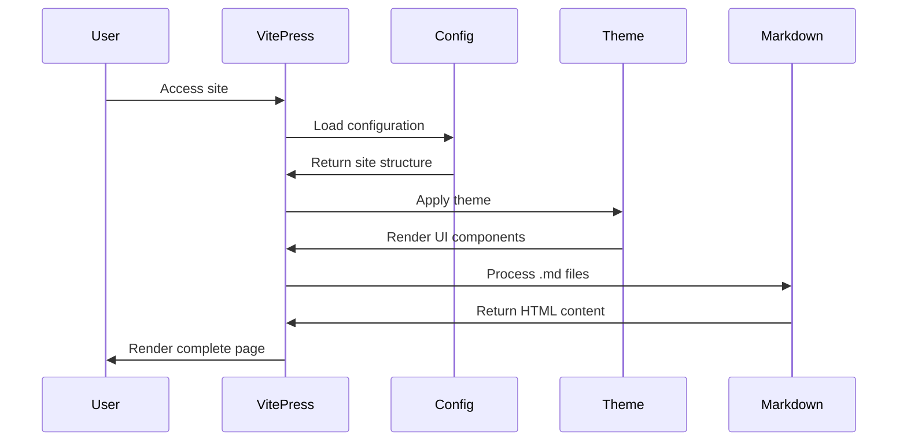

# VitePress Documentation Project (AI Reference)

## Project Architecture Overview


## File Dependencies
| File | Dependencies | Purpose |
|------|--------------|---------|
| .vitepress/config.mts | vitepress | Main configuration file defining site structure and navigation |
| .vitepress/theme/index.ts | vue, vitepress/theme | Custom theme extension using Vue |
| .vitepress/theme/style.css | None | CSS customization for the VitePress theme |
| index.md | None | Home page with frontmatter configuration |
| api-examples.md | vitepress (useData) | Examples of VitePress runtime APIs |
| markdown-examples.md | None | Examples of VitePress markdown extensions |
| source/ai-instruction.md | None | Guidelines for AI-assisted development |
| source/api/draft.rst | None | Draft API documentation in RST format |

## Module Call Flow


## Key File Index
| Path | Description | Primary Functions |
|------|-------------|-------------------|
| .vitepress/config.mts | Site configuration | Defines navigation, sidebar, and site metadata |
| .vitepress/theme/index.ts | Theme customization | Extends default theme, provides layout customization |
| .vitepress/theme/style.css | Visual styling | Customizes colors, components, and responsive design |
| index.md | Home page | Landing page with hero section and feature listing |
| api-examples.md | API documentation | Examples of VitePress runtime API usage |
| markdown-examples.md | Markdown guide | Shows VitePress markdown extensions |
| source/ai-instruction.md | AI development guide | Complete workflow for AI-assisted development |
| source/api/draft.rst | API draft | GraphQL API design for a project called "MaiMBot" |

## Command Reference
```
pnpm docs:dev    # Start development server
pnpm docs:build  # Build production site
pnpm docs:preview # Preview production build
```

## Navigation Structure
- Home (/)
- Examples (/markdown-examples)
  - Markdown Examples (/markdown-examples)
  - Runtime API Examples (/api-examples)

## Content Types
1. **Documentation Pages**: Standard markdown files with optional frontmatter
2. **API Documentation**: Technical references with code examples
3. **Custom Components**: Vue components that can be used in markdown

## Project Context
This is a VitePress documentation site for a project called "MaiMBot", containing:
- Standard documentation pages
- API references and examples
- Custom theme configuration
- Guidelines for AI-assisted development