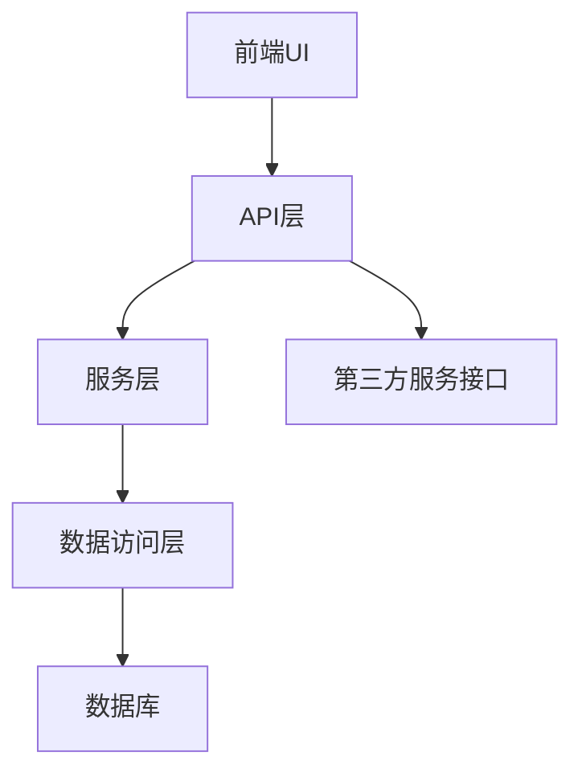

# AI辅助开发大型项目指南

## 目录
1. [项目初始化：让AI熟悉代码库](#项目初始化让ai熟悉代码库)
2. [功能开发流程](#功能开发流程)
3. [建立可复用指南](#建立可复用指南)
4. [文档维护与更新](#文档维护与更新)
5. [知识积累与迭代优化](#知识积累与迭代优化)

---

## 项目初始化：让AI熟悉代码库

在开始使用AI辅助开发之前，需要让AI充分理解项目结构和代码逻辑。

### 步骤1：生成项目文档

使用以下prompt让AI生成项目文档：

```
请分析我的项目代码库，并生成一份详细的项目文档，该文档将用于帮助AI工具更好地理解项目结构。文档应包含：

1. 项目架构概览：用简明的图表或描述展示整体架构
2. 代码文件依赖关系：重点标注核心模块之间的依赖
3. 功能模块调用逻辑：主要业务流程如何在不同模块间流转
4. 关键代码文件索引：列出最重要的文件及其功能描述
5. 常用设计模式与约定：项目中使用的架构模式和编码规范

注意：这份文档是专为AI工具设计的，需要高信息密度，尽量使用图表、表格等形式展示信息，便于快速检索。
```

### 步骤2：审查文档

确保文档涵盖了以下内容：
- 项目的整体架构和分层结构
- 重要模块和组件的列表及其功能
- 关键类、接口或函数的索引和用途
- 代码文件之间的依赖关系
- 业务流程在代码层面的实现路径

### 步骤3：保存文档

将生成的文档保存为`project_overview.md`，以便在未来的对话中快速引用。

**示例文档片段：**

```markdown
## 项目架构概览



## 核心模块索引

| 模块名 | 所在路径 | 主要功能 | 依赖关系 |
|-------|---------|---------|--------|
| UserService | /src/services/user | 用户管理相关功能 | 依赖UserRepository |
| AuthMiddleware | /src/middleware/auth | 身份验证中间件 | 依赖TokenService |
| PaymentController | /src/controllers/payment | 支付相关API接口 | 依赖PaymentService |

## 关键流程调用链

### 用户下单流程
```
OrderController.create() -> 
    OrderService.createOrder() -> 
        ProductService.checkStock() -> 
        UserService.validateAddress() -> 
        OrderRepository.save() -> 
        PaymentService.initiate()
```
```

---

## 功能开发流程

### 步骤1：开始新的对话

每次开发新功能时，创建新的对话，并首先引入项目文档：

```
我需要开发一个新功能，下面是我的项目文档，请先阅读以便了解项目结构：

[粘贴项目文档内容]

现在我需要开发的功能是：[功能描述]
```

### 步骤2：明确需求和实现路径

向AI提供详细的功能需求，并让它提供实现思路：

```
基于上述项目结构，请帮我分析实现这个功能的最佳路径：
1. 需要修改哪些文件？
2. 需要新增哪些代码？
3. 实现过程中需要注意的潜在问题？
4. 有没有现有代码可以参考或复用？
```

### 步骤3：代码实现和调试

让AI生成具体代码并提供集成指导：

```
请为[具体功能模块]生成详细的代码实现，并说明如何将其集成到现有系统中。
```

**示例对话：**

```
用户: 我需要在用户服务中添加一个新功能，允许用户更改他们的通知偏好设置。
根据项目文档，我应该修改哪些文件？

AI: 基于项目文档，您需要修改以下文件：

1. `/src/models/User.js` - 添加通知偏好相关字段
2. `/src/services/user/UserService.js` - 添加更新通知偏好的方法
3. `/src/controllers/user/UserController.js` - 添加API端点处理请求
4. `/src/repository/UserRepository.js` - 添加保存通知偏好的数据库操作

具体代码实现如下...
```

---

## 建立可复用指南

### 步骤1：开发通用功能后生成指南

完成常见功能开发后，使用以下prompt生成指南：

```
我们刚刚完成了[特定功能类型]的开发。请基于我们的实现过程，生成一份AI辅助指南，详细说明如何在这个项目中开发类似功能。

指南应包含：
1. 实现这类功能的标准步骤
2. 需要修改的典型文件
3. 常见的代码模式和最佳实践
4. 潜在的陷阱和解决方案
5. 测试要点

请确保指南信息密度高，主要面向AI辅助工具使用。
```

### 步骤2：保存功能指南

将生成的指南保存为特定功能类型的文档，例如`add_new_api_guide.md`或`create_database_migration_guide.md`。

**示例API开发指南：**

```markdown
# 项目API开发指南

## 标准实现步骤
1. 在`/src/controllers`目录下创建或修改控制器
2. 在`/src/services`目录下实现业务逻辑
3. 在`/src/models`目录下添加或修改数据模型
4. 在`/src/routes`目录下注册路由
5. 在`/tests`目录下添加单元测试

## 代码示例
### 控制器模板
```javascript
class ExampleController {
  async create(req, res) {
    try {
      const data = req.body;
      const result = await exampleService.create(data);
      return res.status(201).json(result);
    } catch (error) {
      return res.status(500).json({ error: error.message });
    }
  }
}
```

## 常见问题
1. 权限控制：所有API都需要通过`/src/middleware/auth.js`进行权限校验
2. 输入验证：使用`/src/utils/validator.js`进行请求参数验证
```

---

## 文档维护与更新

### 步骤1：识别新知识点

每次解决复杂问题或发现新模式后，使用以下prompt更新文档：

```
我们刚刚解决了[具体问题]，这个解决方案包含了一些重要的项目知识。请将这些新发现整合到我们的项目文档中：

新发现：
1. [描述新发现的问题和解决方案]
2. [新的代码模式或最佳实践]

请生成更新后的文档片段，我将把它合并到主文档中。
```

### 步骤2：定期全面更新

每隔一段时间（如项目里程碑后），让AI重新审视整个项目并更新主文档：

```
我们的项目已经经过了几轮迭代，添加了以下新功能：
1. [新功能1]
2. [新功能2]
3. [新功能3]

请基于最初的项目文档和这些新增功能，生成一份更新后的项目文档，确保它反映当前的项目状态。
```

**示例文档更新：**

```
用户: 我们刚刚实现了一个新的缓存机制来优化查询性能，请更新项目文档以包含这个新知识

AI: 以下是文档的更新部分：

## 性能优化策略

### 缓存机制
项目现在使用了多层缓存策略来优化查询性能：

1. **应用层缓存**
   - 位置: `/src/utils/cache/` 
   - 实现: 使用内存缓存（Node-Cache）存储热点数据
   - 适用场景: 高频读取、低频变更的数据

2. **数据库查询缓存**
   - 位置: `/src/repositories/base/CacheableRepository.js`
   - 继承关系: 所有需要缓存的Repository都应继承此类
   - 缓存策略: LRU (最近最少使用)策略，默认过期时间15分钟

3. **缓存失效处理**
   - 触发点: `/src/services/*/update*.js`方法中
   - 模式: 写时失效（Write-Invalidate）

```

---

## 知识积累与迭代优化

### 步骤1：应用积累的知识

当需要开发类似于之前已实现功能的新需求时，引入相关指南：

```
我需要开发一个新功能：[功能描述]。这个功能类似于我们之前实现的[类似功能]。

以下是我们的项目文档和相关功能指南：

[粘贴项目文档]

[粘贴相关功能指南]

请基于这些文档，帮我实现这个新功能。
```

### 步骤2：优化工作流程

定期反思并优化AI辅助开发流程：

```
我们已经使用AI辅助开发了多个功能，请分析我们的工作流程并提出优化建议：

1. 哪些类型的任务AI处理得特别好？
2. 哪些类型的任务仍然需要更多人工干预？
3. 如何改进我们的文档和提示，使AI能更好地理解我们的项目？
4. 有什么自动化工具或脚本可以进一步提高效率？
```

**示例优化建议：**

```markdown
## AI辅助开发流程优化建议

### 高效任务
1. 生成标准CRUD操作代码
2. 单元测试生成
3. 文档编写和更新

### 需改进任务
1. 复杂业务逻辑实现
2. 性能优化建议
3. 架构调整决策

### 文档改进建议
1. 添加更多代码示例和模式
2. 创建常见错误和解决方案目录
3. 包含更详细的测试策略

### 自动化机会
1. 创建项目扫描脚本，自动更新项目文档
2. 开发代码生成模板，基于常见模式
3. 建立功能开发检查清单，确保一致性
```

---

通过遵循这个指南，团队可以有效地利用AI辅助工具加速大型项目的开发，同时积累项目知识，形成正向的开发效率提升循环。随着项目的发展，文档和指南会不断丰富，使AI工具变得越来越有价值。