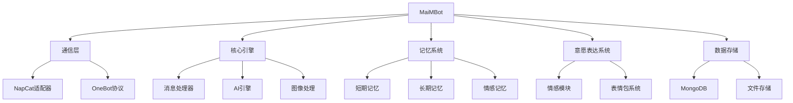
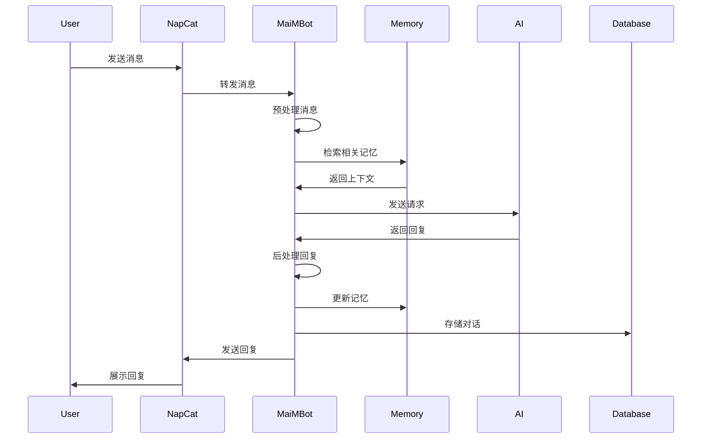
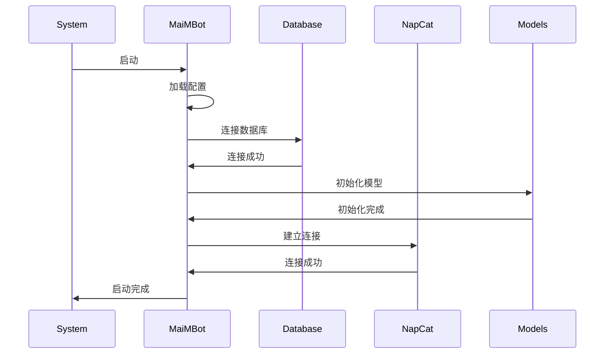

# MaiMBot 项目结构

本文档介绍了MaiMBot项目的整体架构、主要组件和文件组织结构，帮助开发者快速理解项目并进行二次开发。

## 项目架构概述

MaiMBot采用模块化设计，由多个相互独立但协同工作的组件构成。以下是整体架构概览：



## 主要模块说明

### 通信层

通信层负责与QQ平台进行交互，接收和发送消息。主要包括：

- NapCat适配器：实现与NapCat框架的连接
- OneBot协议支持：实现标准OneBot v11协议
- WebSocket服务：提供反向WS接口

### 核心引擎

核心引擎是机器人的中央处理系统，负责逻辑处理和决策：

- 消息处理器：分析、分类和路由收到的消息
- AI引擎：对接硅基流动等LLM提供商
- 图像处理：处理和生成图像内容
- 命令解析器：识别和执行特定命令

### 记忆系统

记忆系统使机器人能够记住过去的交互，提供连续对话体验：

- 短期记忆：存储当前对话上下文
- 长期记忆：保存重要信息和用户偏好
- 情感记忆：记录情感状态和变化
- 向量数据库：高效存储和检索语义信息

### 意愿表达系统

意愿表达系统控制机器人的情感和表达方式：

- 情感模块：模拟人类情感状态
- 表情包系统：管理和使用表情包资源
- 个性表达：根据配置调整回复风格

### 数据存储

数据存储层管理机器人的持久化数据：

- MongoDB：存储结构化数据
- 文件系统：存储媒体文件和表情包
- 缓存机制：提高性能并减少API调用

## 文件组织结构

请参考[详细文件结构文档](./file_structure)了解完整的文件组织。

以下是主要目录的简要说明：

```
MaiMBot/
├── api/                 # API服务接口
├── bot/                 # 核心机器人逻辑
│   ├── commands/        # 命令处理模块
│   ├── handlers/        # 消息处理器
│   ├── memory/          # 记忆系统
│   ├── emotions/        # 情感系统
│   └── utils/           # 通用工具函数
├── config/              # 配置文件目录
├── data/                # 数据存储目录
│   ├── emoji/           # 表情包存储
│   ├── image/           # 图片资源
│   └── logs/            # 日志文件
├── models/              # AI模型接口
├── db/                  # 数据库相关代码
├── tests/               # 测试代码
└── web/                 # Web管理界面
```

## 配置文件说明

MaiMBot使用两个主要配置文件：

### .env.prod

环境配置文件，包含敏感信息如API密钥和数据库连接：

```
# API配置
SILICONFLOW_KEY=sk-xxxxxxxxxxxxxxxxxxxxxxxx
SILICONFLOW_BASE_URL=https://api.siliconflow.cn/v1

# 服务器配置
HOST=127.0.0.1
PORT=8080

# 数据库配置
MONGODB_URI=mongodb://localhost:27017/MegBot
```

### bot_config.toml

机器人行为配置文件，定义机器人的个性和功能选项：

```toml
[bot]
name = "MaiM"
personality = "cute"
memory_window = 10

[models]
chat = "gpt-4"
embedding = "embedding-3-large"
image = "stable-diffusion-v1-6"

[features]
emoji_collection = true
voice_reply = false
group_welcome = true
```

## 开发环境设置

请参考开发环境设置文档来配置本地开发环境：

1. Python 3.9+
2. MongoDB 4.4+
3. 适当的API密钥
4. 开发依赖安装

## 核心流程

### 消息处理流程



### 启动流程



## 性能考量

在开发过程中需要注意的性能相关事项：

1. **API调用优化**：减少不必要的LLM API调用以控制成本
2. **内存使用**：在高频交互群组中注意记忆系统的内存占用
3. **数据库索引**：确保MongoDB集合有适当的索引以提高查询性能
4. **并发处理**：处理多个群聊的同时消息

## 扩展开发指南

如需扩展MaiMBot功能，您可以：

1. 添加新的命令处理器
2. 实现自定义消息处理逻辑
3. 扩展记忆系统功能
4. 添加新的AI模型支持
5. 开发Web管理界面扩展

有关扩展开发的详细信息，请参考[开发者指南](/develop/guide/ai-instruction)。